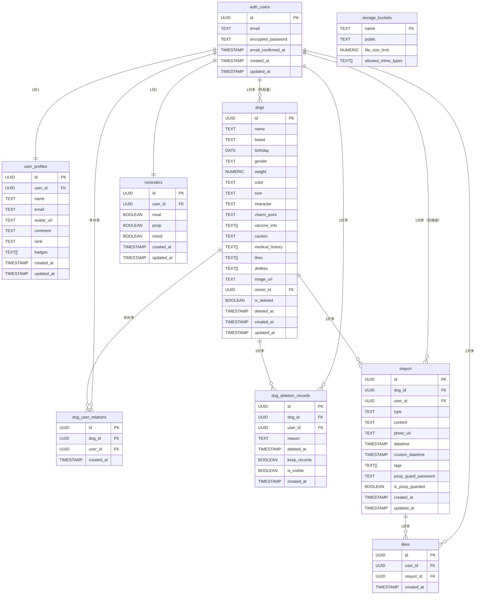

# OTAYORI アプリケーション ER図

## 概要
OTAYORIアプリケーションのデータベース構造を表すER図です。

## ER図

## テーブル説明

### 認証・ユーザー管理
- **auth_users**: Supabase標準の認証テーブル
- **user_profiles**: ユーザーの詳細プロフィール情報

### 犬の管理
- **dogs**: 犬の基本情報と健康データ
- **dog_user_relations**: 犬とユーザーの多対多関係
- **dog_deletion_records**: 犬の削除記録（ソフトデリート対応）

### おたより（投稿）管理
- **otayori**: ごはん・うんち・きもちの投稿データ
- **likes**: 投稿へのいいね機能

### 設定・通知管理
- **reminders**: リマインダー設定

### ストレージ設定
- **storage_buckets**: 画像ファイルの保存設定

## 主要な制約

### 外部キー制約
- すべてのテーブルで適切な外部キー制約が設定されています
- CASCADE削除により、親レコード削除時に子レコードも自動削除されます

### チェック制約
- `otayori.type`: 'meal', 'poop', 'emotion'のいずれか
- `dog_deletion_records.reason`: 'mistake', 'transfer', 'rainbow_bridge', 'other'のいずれか

### ユニーク制約
- `user_profiles.user_id`: ユーザー1人につき1つのプロフィール
- `likes(user_id, otayori_id)`: 同じユーザーが同じ投稿に複数回いいねできない

## セキュリティ

### Row Level Security (RLS)
すべてのテーブルでRLSが有効化されており、ユーザーは自分のデータのみアクセス可能です。

### インデックス
パフォーマンス向上のため、主要なクエリパターンに対応したインデックスが設定されています。

---

**作成日:** 2025年5月  
**バージョン:** 1.0 